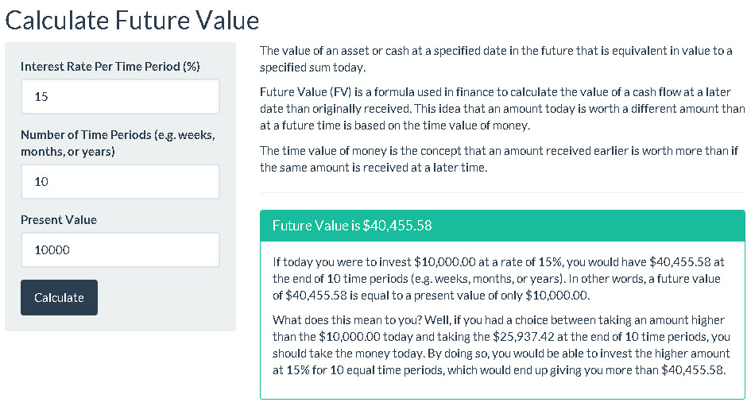

---
title       : Developing Data Products
subtitle    : Future Value Calculator
author      : New Yi Qing, Izack
job         : Application Developer
framework   : io2012        # {io2012, html5slides, shower, dzslides, ...}
highlighter : highlight.js  # {highlight.js, prettify, highlight}
hitheme     : tomorrow      # 
widgets     : [mathjax]     # {mathjax, quiz, bootstrap}
mode        : selfcontained # {standalone, draft}
knit        : slidify::knit2slides
---  #page2 

## About the Future Value Calculator
The value of an asset or cash at a specified date in the future that is equivalent in value to a specified sum today.
  
Future Value (FV) is a formula used in finance to calculate the value of a cash flow at a later date than originally received. This idea that an amount today is worth a different amount than at a future time is based on the time value of money.
  
The time value of money is the concept that an amount received earlier is worth more than if the same amount is received at a later time. 
  
To make the Future Value Calculator avaliable for use anytime and anywhere, it is hosted at 
- https://towkaynew.shinyapps.io/future-value-calculator/

--- #page3

## Formula

Formula for Future Value:

$$FV = PV * (1+r)^n$$
FV = Future value  
PV = Present Value  
r = Interest Rate Per Time Period (%)  
n = Number of Time Periods
  
### Example
  
Supposed my present value is $10,000. With the rate of 15%, after 10 years, my future value will be:

```{r} 
10000 * (1 + 0.15)^10
```

--- #page4

## Getting Future Value from the user interface



--- #page5

## References

* http://www.financeformulas.net/Future_Value.html
* http://en.wikipedia.org/wiki/Future_value
* http://shiny.rstudio.com/tutorial/


